# Not Ditto Can Fight

Treat your NFT not only as a life-time collection but also a unique ticket to JOIN THIS LOTTERY GAME!

## Features

| Progress  | Description                                                             |
| --------- | ----------------------------------------------------------------------- |
| `Phase 1` | Mint a Not-Ditto NFT by showing a ownership of a ERC721 or ERC1155 NFT  |
| `Phase 1` | Each Not-Ditto NFT will have it own elemental attribute & abilities     |
| `Phase 1` | Gain experience points by unlocking offline rewards                     |
| `Phase 1` | Reach LV.100 to participate in exciting draws for incredible prizes     |
| `Phase 2` | Fight in arena to earn extra experience points and magical artifacts    |
| `Phase 3` | Utilize referral code to speed by leveling processing with your friends |

## Notes

- We will check the ownership of the NFT you provided to mint the Not-Ditto whenever you want to gain offline rewards, step into arena, or use referral code or artifacts
- Each player has limited batch size and mint amount according to Not Ditto Can Fight's setting
- Not-Ditto NFT **CAN'T** be transfered. We hope you take good care of your own Not-Ditto and ensure your Not-Ditto won't get lose in any cases.

## Workflow

### Changelogs & PR
- set up storage for Not-Ditto NFT
- complete ERC1155 functionality to realize Not-Ditto NFT