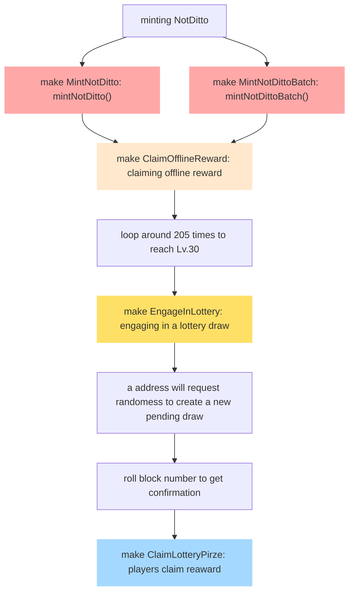

# Not Ditto Can Fight

Treat your NFT not only as a life-time collection but also a unique ticket to JOIN THIS LOTTERY GAME!

## Description

| Available Features                                                      |
| ----------------------------------------------------------------------- |
| Mint a Not-Ditto NFT by showing a ownership of a ERC721 NFT             |
| Each Not-Ditto NFT will have it own elemental attribute                 |
| Gain experience points by claiming offline rewards with raise fee       |
| Reach LV.30 to participate in lottery draws for incredible prizes       |
| Utilize referral code to speed by leveling processing with your friends |

| Future Features                                                                |
| ------------------------------------------------------------------------------ |
| Fight in arena to earn extra experience points and Lucky stars                 |
| Take your friends' NotDittos to fight in arena to gain Lucky stars by approval |
| Use Lucky stars to make your NotDitto grow  incredibly fast                    |
| Trade or Make up pieces of Lucky stars with other players                      |

## Notes

- We will check the ownership of the NFT you provided to mint the Not-Ditto whenever you want to gain offline rewards, step into arena, or use referral code or artifacts
- Each player has limited batch size and mint amount according to Not Ditto Can Fight's setting
- Not-Ditto NFT **CAN'T** be transfered. We hope you take good care of your own Not-Ditto and ensure your Not-Ditto won't get lose in any cases.

## Framework & Usage
The project is conducted by utilizing `Foundry` as the contract framework.     
Also, other packages are utilized as well to make development smooth and have more reliability, such as `OpenZeppelin` for IERC1155 and `ChainLink` for VRFV2.
### Modules   
#### Overview
The [`NotDittoCanFight.sol`](./contracts/NotDittoCanFight.sol) is the main entry contract which inherits from VRFV2 consumer named [`RandomNumber.sol`]('./contracts/Oracle/RandomNumber.sol') and ERC1155 named [`NotDittoAndItems.sol`](./contracts/NFT/NotDittoAndItems.sol).    
In addition, most calculations for claiming level or lottery prize are separated in [`Level.sol`]('./contracts/libs/Level.sol') and [`Lottery.sol`]('./contracts/libs/Lottery.sol'). 

#### **NotDittoCanFight.sol**
The core game contract for engaging in the games and claiming prizes. To level up a NotDitto, a player should wait for certain time to get portion and claim for offline rewards. By repeating the raising process, a 30-leveled NotDitto accesses to the lottery draw. Moreover, each address (yes, you don't have to be a player) have ability to create a pending new draw or take the unattended NotDitto to the orphanage to gain rewards.     

*Note*:       
1. Experience point has decimals with 3 due to the number of time in Solidity is not supported for ms and the calculation for leveling will have 3 float points. By doing so, players can have more flexibility of accumulating offline reward.     
2. Players should claim reward if engaged tickets has been up to three. Otherwise, they will fail to join a new draw.    
3. You can see more about error message in [ErrorConfig.sol](./contracts/NFT/ErrorConfig.sol)


|Function| Description                                                                                                                                   |
|--------|-----------------------------------------------------------------------------------------------------------------------------------------------|
|`claimOfflineReward` (uint256 tokenId) external payable | pay raise fee (2.5% of mint fee) to claim exp for a NotDitto                                  |
|`engageInLottery` (uint256 tokenId, uint256[4] memory lotteryNumber) external | take a 30-leveled NotDitto to the draw and it will be burned            |
|`claimLotteryPrize` () external | claim reward of all engaged tickets (prize will range in 0.8, 1, 1.2, 2, 5, see more in Lottery.sol in libs)          |
|`createNextDraw` () external | request new randomess from Chainlink and will create a pending new draw till randomess is received                       |
|`takeUnattendedNotDittoToOrphanage` (uint256 id) external | take NotDitto to orphanage if it has been unattended for 7 days (enable everyone to burn it)|

---  

#### **NotDittoAndItems.sol**
The contract with inheritance of IERC1155 to combine NotDitto (ERC721-alike ERC20) and LuckyStar (Multiple ERC20).      
Realize functionalities of minting and burning NotDittos for now, which are the core ones for joining the game and lottery.           
Only IERC1155 is implemented to fit the mechanism of the game due to the workflow of `transfer`, and `approve`.      
For example, NotDitto can't be transfered by player to players, but can be approve to join an arena fight. In the other hand, LuckyStar are surely able to be transfered between players but the approval of stars are meaningless for now. 

|Function| Description                                                                                                                                   |
|--------|-----------------------------------------------------------------------------------------------------------------------------------------------|
|`mintNotDitto` (address nftAddress, uint256 nftId) external payable | pay mint fee with ownership of a ERC721 to mint a NotDitto as a lottery ticket    |
|`mintNotDittoBatch` (uint256 amount, address[] memory nftAddresses, uint256[] memory nftIds) external payable | same as mintNotDitto() but with the control of minting amount  |      

*Note*:       
1. The contract will directly assign a new-born or orphan NotDitto to the player depending on the times of minting and burning.

---    


#### **RandomNumber.sol**
The contract implemented from Chainlink v0.8's VRFV2 generates random number for lottery number and split 4 arenas.     
To simplify the process of utilizing this service and testing, `directly funding` is currently the method to carry out randomness.            
In the future, when the game has a pending new draw, the contract will exchange ETH for LINK to pay for the request.  

## Development
To setup project, please follow the .env.exmaple to create .env for running test.

## Testing
There are 5 main testing contracts to separate the process of checking the workflow from minting NotDitto, leveling up to Lv.30, take it to engaging in the lottery, initilize a new pending draw, to claiming the prize.      

### Initialize all testing files through --via-ir
To speed up compiling, it's recommended to start from the init command below and following the other steps to checkout each test file to go through process.
```bash
forge test --via-ir
```    

### Follow commands of Makefile

```bash
# to test single or batch mint
make MintNotDitto || make MintNotDittoBatch
# to test claim offline reward after mining
make ClaimOfflineReward
# to test engaging in lottery draw after reaching to lv30
make EngageInLottery
# to test the whole process
make ClaimLotteryPirze

```



## References

1. [Excel to check fairness of the game](https://docs.google.com/spreadsheets/d/1f9I2Zx6CNkebpZ-NZ3TdmCatKp9dpw4snaAjr-flyhE/edit?usp=sharing)
2. [NotDitto (original project)](https://notditto.xyz/) 
3. [Calculation of Level experience for Pokemon](https://bulbapedia.bulbagarden.net/wiki/Experience)
4. [Notion for tracking project management](https://strong-caboc-c3d.notion.site/cafa6ffed7a0478f993561a01b5a9026?v=210614fab0e74a27ab0e995bc9a1c554&pvs=4)